# ReVeste ♻️

<p align="center">
  <strong>Moda circular, novas possibilidades.</strong>
</p>

<p align="center">
  Aplicativo que conecta consumidores a brechós profissionais, facilitando a descoberta de lojas, a busca por peças e a compra de roupas de segunda mão.
</p>

---

## Sobre o projeto

A **ReVeste** é um aplicativo de moda circular desenvolvido para aproximar consumidores e brechós profissionais em um único ambiente digital.

Muitos brechós divulgam seus produtos por meio de redes sociais e publicações temporárias, o que pode dificultar a busca por lojas, a consulta de peças disponíveis e a comparação de opções antes de uma visita.

A ReVeste busca resolver esse problema reunindo localização, perfis comerciais, catálogo de produtos e comunicação dentro do aplicativo.

O projeto foi desenvolvido em Flutter como parte dos Checkpoints 4, 5 e 6 da disciplina de Cross Application.

## Objetivo e público-alvo

**Objetivo:** facilitar a descoberta de brechós e o acesso a roupas de segunda mão por meio de uma aplicação multiplataforma.

**Público-alvo:**
- **Consumidores:** pessoas interessadas em moda de segunda mão, economia e consumo consciente.
- **Brechós profissionais:** estabelecimentos que desejam divulgar suas peças, organizar seus catálogos e alcançar novos clientes.

## Proposta de valor

A ReVeste centraliza recursos que normalmente estão distribuídos entre diferentes plataformas, tornando a busca por roupas de segunda mão mais organizada.

Para os consumidores, oferece praticidade na descoberta de lojas, pesquisa de produtos, favoritos e acompanhamento de pedidos. Para os brechós, oferece um espaço para divulgar peças, gerenciar sua disponibilidade e manter contato com clientes.

Como possibilidade de negócio futuro, o aplicativo poderá adotar planos gratuitos e pagos para os brechós, com recursos adicionais de divulgação. Esse modelo ainda é uma proposta de evolução comercial.

## Identidade visual e marca

### Significado do nome

O nome **ReVeste** combina a ideia de reutilização com o ato de vestir. O prefixo “Re” remete à renovação e ao reuso, enquanto “Veste” conecta a marca diretamente ao universo da moda.

### Paleta de cores

| Cor | Código | Aplicação |
|---|---|---|
| Verde escuro | `#355E4B` | Elementos principais e botões |
| Creme | `#F7F2E8` | Fundos e áreas de respiro |
| Terracota | `#C96F4A` | Destaques e etiquetas |
| Verde sálvia | `#A9BFAF` | Cards e elementos secundários |
| Grafite esverdeado | `#22352D` | Textos e ícones |
| Branco | `#FFFFFF` | Fundos e contraste |

O tom de voz da marca é acolhedor, acessível, prático e consciente, reforçando a proposta de tornar a moda circular mais próxima das pessoas.

**Protótipo e identidade visual:** [Acessar o Figma](https://www.figma.com/design/j254jze0orFy3FMuPbmGqL/CheckPoint-04---CPAD?node-id=0-1&t=wyqk9D4hTnVJuCpF-1).

## Funcionalidades do aplicativo

### Consumidor
- Cadastro, login e verificação de e-mail.
- Seleção de preferências de estilo.
- Descoberta e pesquisa de brechós.
- Consulta de perfis comerciais e produtos.
- Filtros de pesquisa e favoritos.
- Carrinho e checkout demonstrativo.
- Acompanhamento e gerenciamento de pedidos.
- Comunicação com os brechós por chat.

### Brechó
- Autenticação e perfil comercial.
- Cadastro e edição das informações da loja.
- Cadastro e divulgação de peças.
- Gerenciamento da disponibilidade dos produtos.
- Acompanhamento de pedidos.
- Comunicação com consumidores por mensagens.

**Importante:** o fluxo de compra é demonstrativo. O pagamento não é processado financeiramente pelo aplicativo.

## Telas do aplicativo

As telas a seguir apresentam os principais fluxos de navegação da ReVeste, desde o acesso à plataforma até as funcionalidades destinadas aos consumidores e brechós.

<table>
  <tr>
    <td align="center"><strong>1. Tela inicial</strong><br>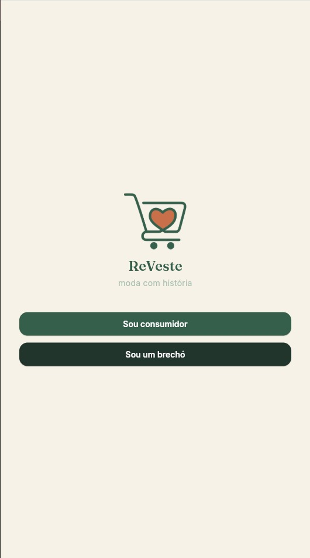</td>
    <td align="center"><strong>2. Login do consumidor</strong><br>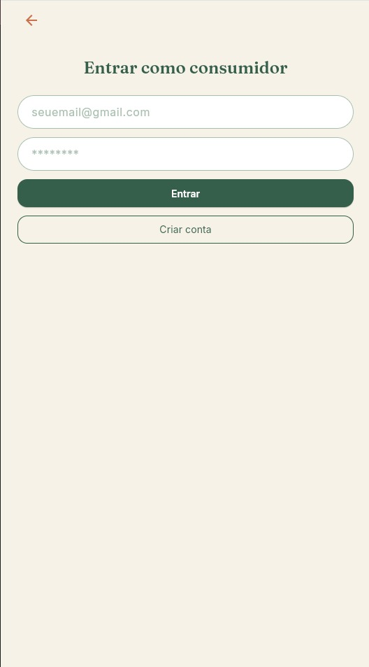</td>
    <td align="center"><strong>3. Criar conta</strong><br>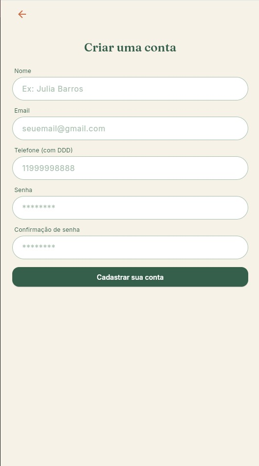</td>
  </tr>
  <tr>
    <td align="center"><strong>4. Confirmar e-mail</strong><br>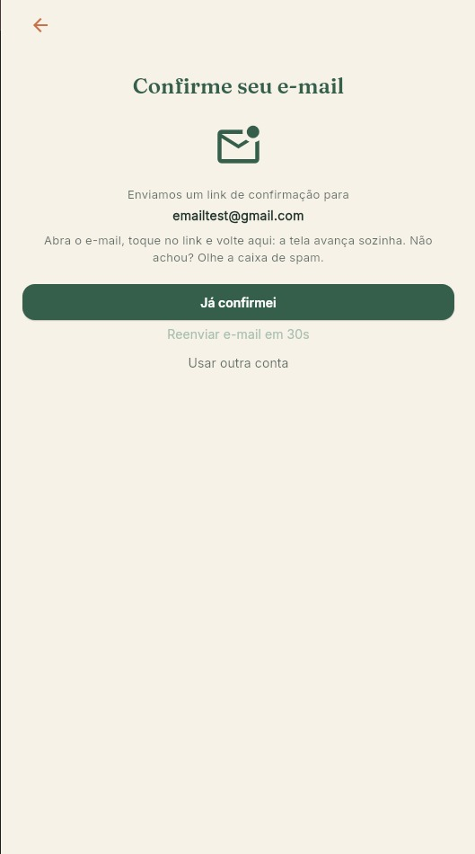</td>
    <td align="center"><strong>5. Início</strong><br>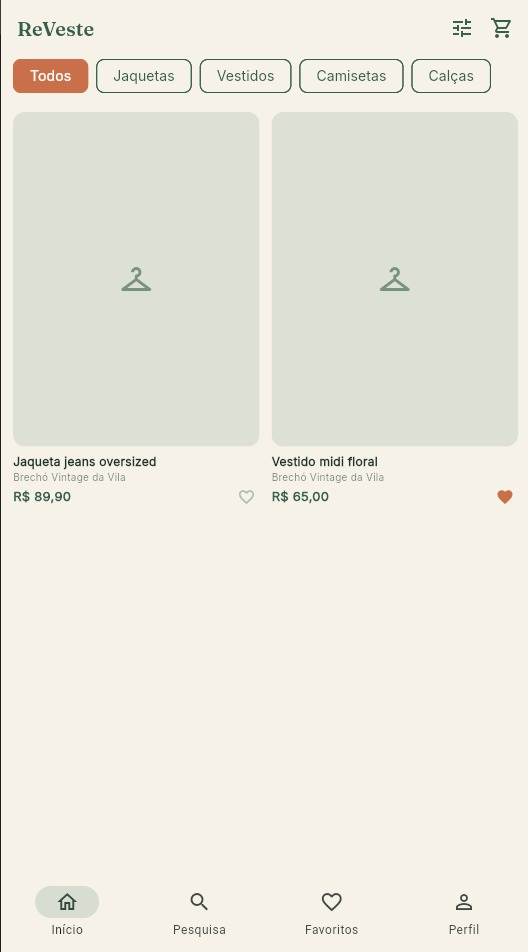</td>
    <td align="center"><strong>6. Pesquisa</strong><br>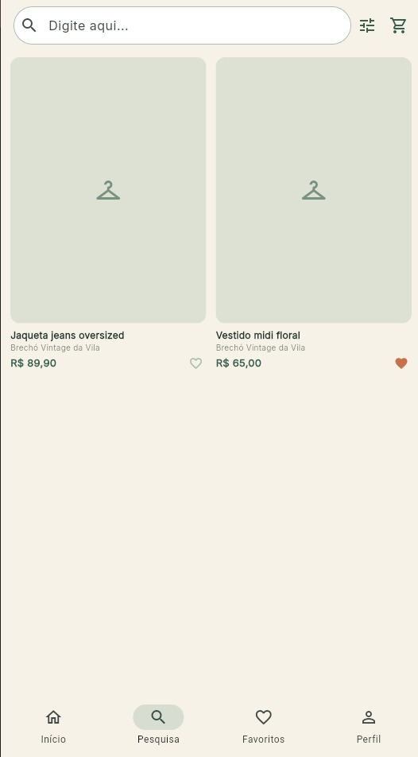</td>
  </tr>
  <tr>
    <td align="center"><strong>7. Favoritos</strong><br>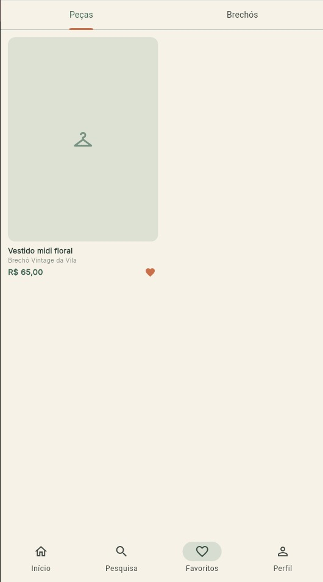</td>
    <td align="center"><strong>8. Perfil</strong><br>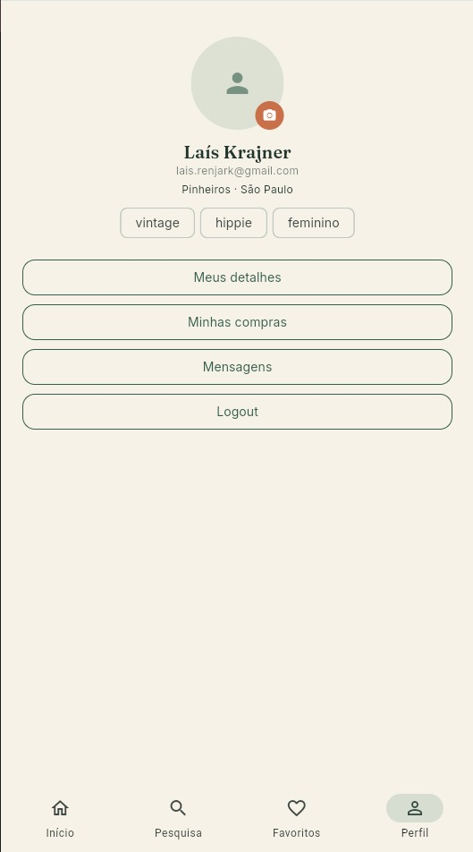</td>
    <td align="center"><strong>9. Login do brechó</strong><br>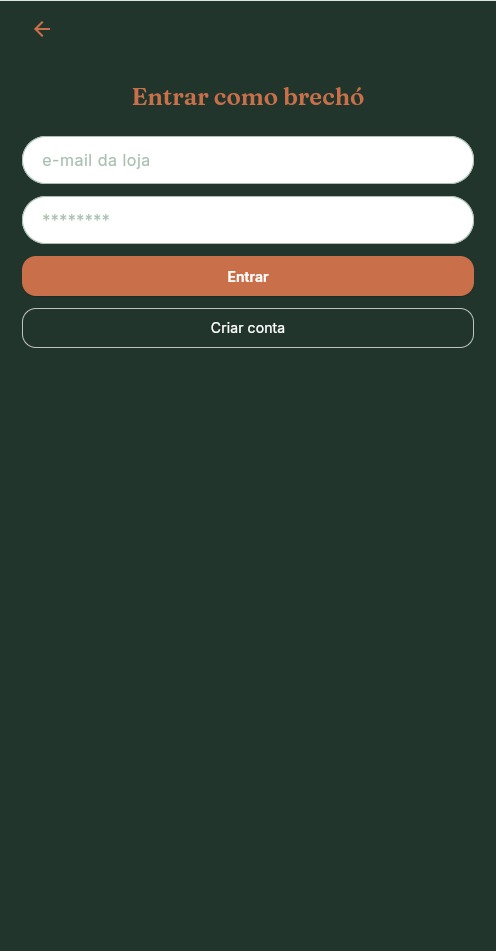</td>
  </tr>
  <tr>
    <td align="center"><strong>10. Acesso do brechó</strong><br>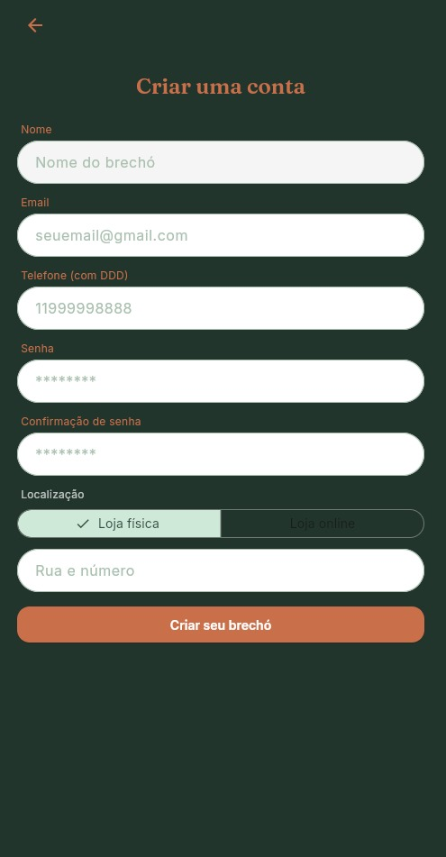</td>
    <td align="center"><strong>11. Confirmar e-mail</strong><br></td>
    <td align="center"><strong>12. Minha loja</strong><br>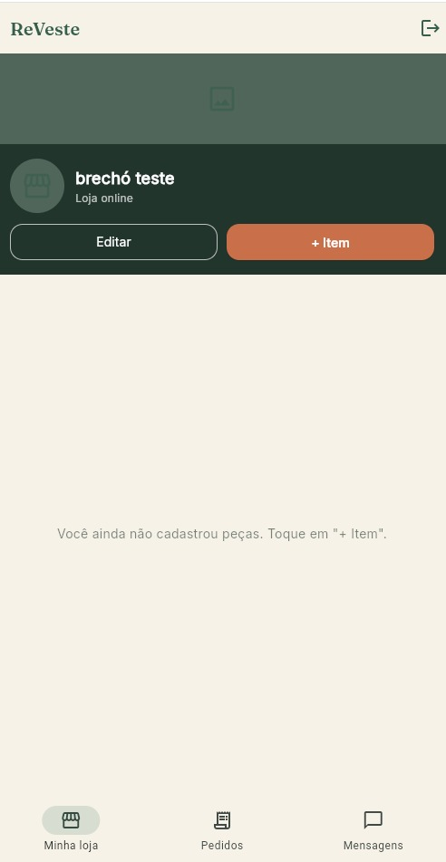</td>
  </tr>
  <tr>
    <td align="center"><strong>13. Cadastrar peça</strong><br>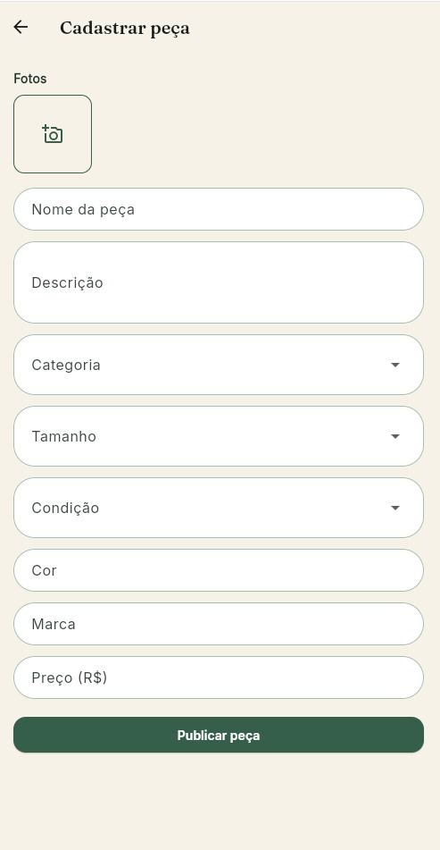</td>
    <td align="center"><strong>14. Editar loja</strong><br>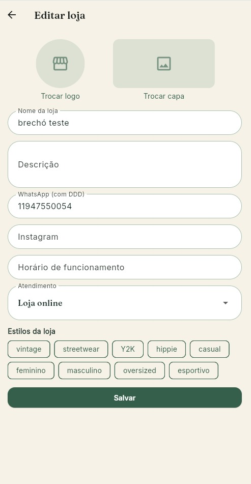</td>
    <td></td>
  </tr>
</table>

## Tecnologias utilizadas

| Tecnologia | Utilização |
|---|---|
| Flutter e Dart | Desenvolvimento da aplicação |
| Firebase Authentication | Autenticação de usuários |
| Cloud Firestore | Armazenamento e consulta de dados |
| Firebase Storage e Cloudinary | Alternativas para armazenamento de imagens |
| Image Picker | Seleção de imagens |
| Google Fonts | Tipografia |
| HTTP e URL Launcher | Recursos de comunicação e abertura de links |

## Arquitetura do projeto

O projeto utiliza uma estrutura modular para separar as responsabilidades e facilitar a manutenção do código.

```text
ReVeste/
├── README.md
├── assets_readme/
└── reveste/
    ├── firebase_rules/
    ├── lib/
    │   ├── models/
    │   ├── services/
    │   ├── state/
    │   ├── screens/
    │   │   ├── auth/
    │   │   ├── consumer/
    │   │   ├── brecho/
    │   │   ├── store/
    │   │   └── chat/
    │   ├── widgets/
    │   ├── theme/
    │   ├── firebase_options.dart
    │   └── main.dart
    └── pubspec.yaml
```

- **Models:** representam as entidades e os dados da aplicação.
- **Services:** concentram as integrações com autenticação, banco de dados, imagens, pedidos e mensagens.
- **State:** gerencia estados compartilhados, como o carrinho.
- **Screens:** organizam as telas de autenticação, consumidor e brechó.
- **Widgets e theme:** reúnem componentes reutilizáveis e elementos visuais.

## Banco de dados

O **Cloud Firestore** é utilizado para persistir as informações da aplicação, enquanto o Firebase Authentication gerencia o acesso dos usuários.

As principais coleções utilizadas são:

| Coleção | Finalidade |
|---|---|
| `users` | Perfis dos usuários |
| `stores` | Perfis comerciais dos brechós |
| `products` | Produtos, preços, imagens e disponibilidade |
| `categories` | Categorias de produtos |
| `orders` | Pedidos e seus status |
| `chats` | Conversas entre consumidores e brechós |
| `messages` | Mensagens das conversas |

O fluxo de compra utiliza transações para registrar pedidos e atualizar a disponibilidade das peças de forma consistente. O chat utiliza as funcionalidades do Firebase para atualizar mensagens em tempo real.

## Como executar o projeto

### Pré-requisitos
- Flutter SDK instalado.
- Google Chrome ou Android Studio com emulador configurado.
- Projeto Firebase configurado para a aplicação.

### 1. Clonar o repositório

```bash
git clone https://github.com/Iuanamagalhaes/ReVeste.git
cd ReVeste/reveste
```

### 2. Instalar as dependências

```bash
flutter pub get
```

### 3. Configurar o Firebase

Confira o arquivo `lib/firebase_options.dart` e confirme que ele corresponde ao projeto Firebase utilizado pela aplicação.

No console do Firebase:
1. Ative a autenticação por e-mail e senha.
2. Configure o Cloud Firestore e suas regras de acesso.
3. Configure o armazenamento de imagens utilizado pelo projeto.
4. Revise as permissões antes de publicar as regras.

### 4. Executar no navegador

```bash
flutter run -d chrome
```

### 5. Executar no emulador Android

Inicie um emulador no Android Studio e execute:

```bash
flutter devices
flutter run
```

Para verificar o projeto, também podem ser executados:

```bash
flutter analyze
flutter test
```

## Geração do APK

Para gerar o aplicativo instalável para Android, execute dentro da pasta `reveste`:

```bash
flutter build apk --release
```

O arquivo será gerado em:

```text
build/app/outputs/flutter-apk/app-release.apk
```

## Aprendizados

O desenvolvimento da ReVeste permitiu ao grupo trabalhar com planejamento de produto, identidade visual, navegação entre telas, organização de código e integração com serviços externos.

A implementação também trouxe desafios relacionados à autenticação, persistência de dados, imagens, controle de pedidos e tratamento de estados. Esses pontos reforçam a importância de integrar interface, dados e regras de negócio para construir uma aplicação consistente.

## Integrantes e responsabilidades

| Integrante | RM | Responsabilidade |
|---|---|---|
| Bernardo Silva Berwanger | RM565776 | Ideia de venda |
| João Vitor Angeloti Sena | RM563473 | Protótipo funcional com dados mockados |
| Laís Krajner Lacerda | RM563182 | Criação da identidade visual e navegação entre telas|
| Luana Magalhães Freire | RM565305 | Desenvolvimento do projeto Flutter inicial, ambiente de teste e integração com Banco de Dados |
| Pamella Souza da Silva Ferreira | RM566172 | Relatório inicial completo, documentação final e organização do README |

## Links

- [Repositório GitHub](https://github.com/Iuanamagalhaes/ReVeste)
- [Protótipo no Figma](https://www.figma.com/design/j254jze0orFy3FMuPbmGqL/CheckPoint-04---CPAD?node-id=0-1&t=wyqk9D4hTnVJuCpF-1)
- [Releases e APK](https://github.com/Iuanamagalhaes/ReVeste/releases)

---

<p align="center">
  <strong>ReVeste — novas possibilidades para as roupas, novas conexões para quem veste.</strong>
</p>
