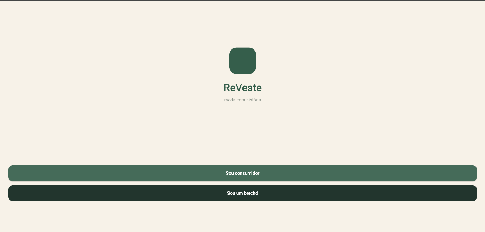

# ReVeste

**Aplicativo para Descoberta de Brechós**

## Sobre o projeto

A ReVeste é um aplicativo de moda circular que aproxima consumidores e brechós profissionais. A proposta nasce da percepção de que muitas lojas desse segmento divulgam suas peças de forma fragmentada, principalmente por redes sociais, mensagens e publicações temporárias, o que dificulta, para quem quer comprar roupas de segunda mão, encontrar estabelecimentos próximos, conhecer o estilo de cada loja e consultar as peças disponíveis antes de se deslocar.

O app reúne localização, catálogo e contato em um único ambiente: o consumidor descobre brechós por localização (ou por região informada manualmente), acessa perfis de lojas, pesquisa produtos, aplica filtros e salva itens de interesse; o brechó mantém um perfil comercial e cadastra as peças que deseja divulgar.

O projeto está sendo construído em **Flutter**, ao longo dos Checkpoints 4, 5 e 6.

## Proposta de valor

A ReVeste torna a procura por roupas de segunda mão mais organizada, aproximando consumidores de brechós da sua região e permitindo conhecer as lojas antes de visitá-las.

- **Para o consumidor:** economia de tempo e mais chances de encontrar peças compatíveis com estilo, tamanho e orçamento, sem precisar alternar entre redes sociais, mapas e mensagens.
- **Para o brechó:** maior visibilidade entre pessoas que já têm interesse nesse tipo de compra, com um catálogo apresentado de forma clara, sem substituir os canais que a loja já utiliza.

## Objetivo geral

Desenvolver uma aplicação multiplataforma em Flutter capaz de conectar consumidores e brechós profissionais, facilitando a descoberta de lojas, a consulta de produtos e o início do processo de compra.

## Identidade visual (proposta inicial)

| Cor | Código | Aplicação sugerida |
|---|---|---|
| Verde escuro | `#355E4B` | Cor principal, botões e elementos de destaque |
| Creme | `#F7F2E8` | Fundos claros e áreas de respiro |
| Terracota | `#C96F4A` | Destaques secundários e etiquetas |
| Verde sálvia | `#A9BFAF` | Cards e elementos de apoio |
| Grafite esverdeado | `#22352D` | Textos e ícones de maior contraste |
| Branco | `#FFFFFF` | Fundos, superfícies e contraste |

##  Integrantes do grupo

| Nome | RM |
|---|---|
| Bernardo Silva Berwanger | RM565776 |
| João Vitor Angeloti Sena | RM563473 |
| Laís Krajner Lacerda | RM563182 |
| Luana Magalhães Freire | RM565305 |
| Pamella Souza da Silva Ferreira | RM566172 |

Link do Figma: https://www.figma.com/design/j254jze0orFy3FMuPbmGqL/CheckPoint-04---CPAD?node-id=0-1&t=wyqk9D4hTnVJuCpF-1
